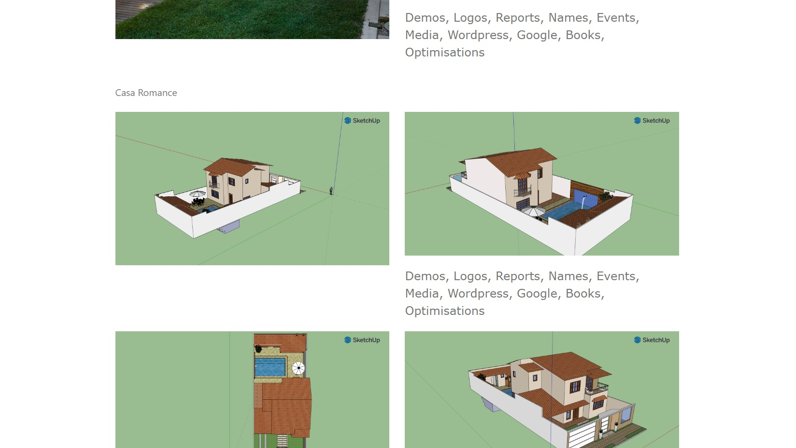
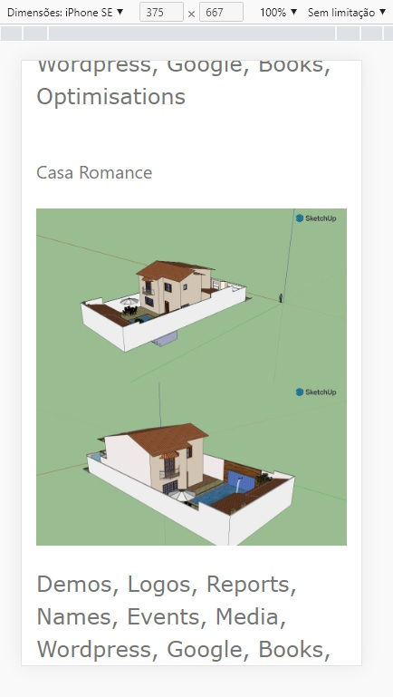

<h4 align="center"> 
	🚧 Edificações 3D 🚀
</h4>

  

   

- Aplicação para expor detalhes de projetos e imagens que demonstram como ficará depois de pronto.
- Permitir visualizar em dispositivos: smartphones, tablets e desktops.

### Inspirações

- [Inspirações 1](https://www.1m2.com.br/blog/profissional-da-construcao-civil/)
- [Inspirações 2](https://www.crtsp.gov.br/tecnicos-em-edificacoes-construindo-reformando-e-fazendo-historia/)
- [Inspirações 3](https://ecid.com.br/curso-online/tecnico/curso-tecnico-de-edificacoes-ead?gclid=CjwKCAjwkaSaBhA4EiwALBgQaC2kxxAbdiL-_DdsFgTbU3ikoEPnQ09lfSt4JBuQ2l7YW945Un6zXRoCNNwQAvD_BwE)
- [Inspirações 4](http://www.grautecnico.com.br/blog/curitiba/tecnico-em-edificacoes-quanto-ganha-conheca-a-profissao/)
- [Inspirações 5](https://blog.sesisenai.org.br/tecnico-em-edificacoes/)
- [Inspirações 6](https://urbano.pbh.gov.br/edificacoes/#/)
- [Inspirações 7](https://projetopronto.com.br/)
- [Inspirações 8](https://www.plantapronta.com.br/)
- [Inspirações 9](https://123projetei.com/)
- [Inspirações 10](https://archshop.com.br/)
- [Inspirações 11](https://engonline.com.br/)
- [Inspirações 12](https://www.maspprojetos.com/)
- [Inspirações 13](https://planoeprojeto.com/)
- [Inspirações 14](http://www.progen.com.br//)
- [Inspirações 15](https://onwe.com.br/)

### Organização de projeto

Pasta com os projetos e pasta com as imagens.

## Tarefas

- [x] inserir os arquivos das imagens
- [ ] inserir os arquivos dos projetos
- [ ] configurar os id e links menus
- [ ] favicon

## Telas

- Desktop

  

- Mobile

  

